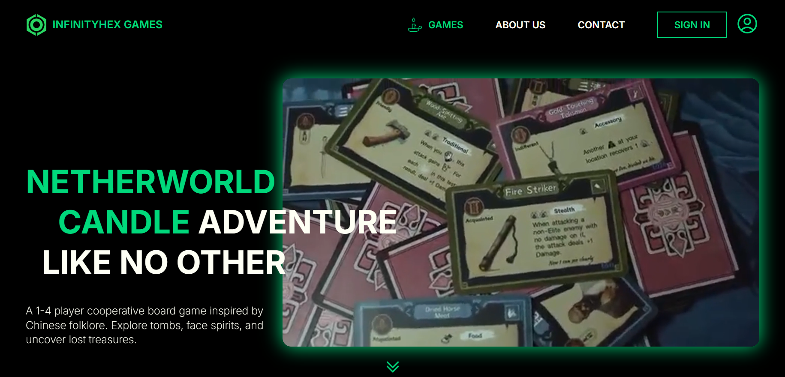

<div align="center">
  <h1>Welcome to InfinityHex Games</h1>
  <p>
    <strong>Supernatural Board Game Experience | Crafting Immersive Journeys with Next.js</strong>
  </p>
  <p>
    <a href="https://netherworld-candle.vercel.app/" target="blank" >Visit Website</a> |
  </p>
  <h6>Developed by RITA ZHAO</h6>
</div>

<br>

## 🕯️ Overview

> **Netherworld Candle**: A 1-4 player cooperative board game inspired by Chinese folklore. Explore tombs, face spirits, and uncover lost treasures.

This project serves as the digital home for **InfinityHex Games**. Built with **Next.js**, the site focuses on delivering a high-atmosphere visual experience through modular architecture, optimized for fast loading and seamless storytelling.

<div align="center">
  
</div>

---

## 🎨 Key Features

- 📱 **Responsive Folklore UI**: A dark-mode aesthetic fully optimized for all devices, ensuring the "Netherworld" vibe translates perfectly to mobile and desktop.


- ⚡ **Performance Optimization**: Leveraging Next.js Image optimization and lazy-loading to handle high-resolution game assets without compromising speed.


- 🚀 **Component-Based Showcase**: Built with highly reusable components for game boards, character cards, and rule sections, allowing for easy expansion of the game universe.


- 🏮 **Interactive Immersion**: Custom UI elements including glowing neon accents and thematic transitions to mirror the game's supernatural atmosphere.

---

## 🗂 Tech Stack

The core technologies driving this tabletop gaming platform:

- 🎨 **Frontend:** Next.js (React)
- 📠 **Pattern:** Component-Based Architecture
- 🌳 **Backend:** Next.js (Serverless Functions)
- ☁️ **Cloud:** Vercel
- ♾ **CI/CD:** Vercel
- 🎩 **Deployment:** Vercel

---

## 🚀 Running

Dev:
```sh
npm run dev
```
Prod:
```sh
npm run build
```
---

## 🗺️ Feature Roadmap

- **Responsive Design**: Ensuring a seamless user experience across all devices, from mobile phones to desktops.
- **Visual Enhancements**: Adding smooth hover states and transition effects to improve site interactivity.
- **Image Performance**: Optimizing high-resolution game assets for faster loading and better visual quality.
- **Interactive Gallery**: Developing a dedicated viewer for high-definition character and card artwork.
- **Rulebook Section**: Integrating a dedicated area for players to view or download the game manual.

---
## 📯 Contact Me

I'm always open to discussing new projects, creative ideas, or opportunities to be part of your visions.

- **GitHub**: [@RITAZ97](https://github.com/RITAZ97/rita-portfolio)
- **Email**: [ritazhaocareer@gmail.com](mailto:ritazhaocareer@gmail.com)

## 📑 License

MIT